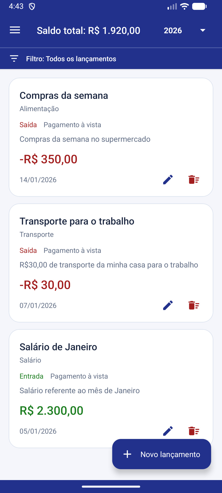
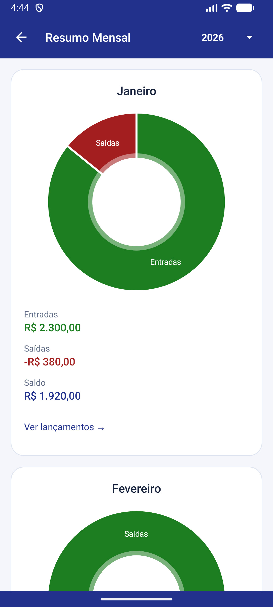
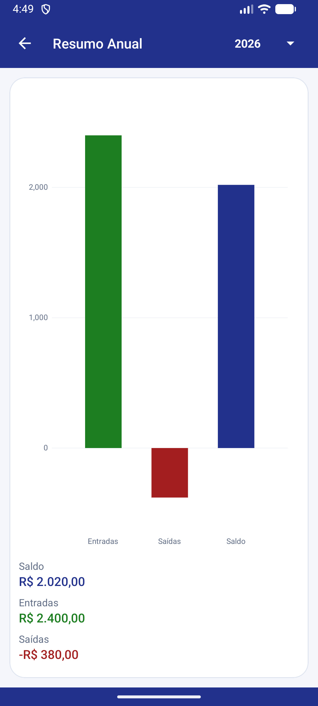
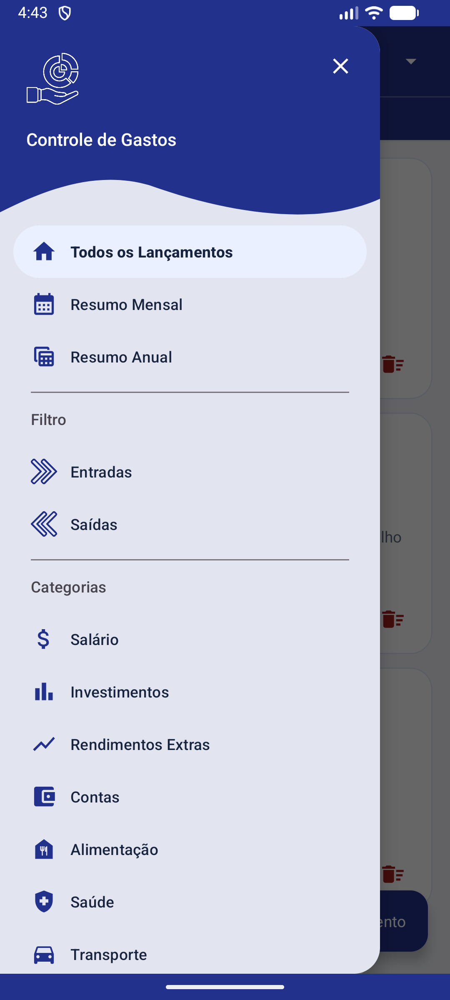

# 📊 Controle de Gastos

O Aplicativo Android nativo Controle de Gastos foi desenvolvido para auxiliar o usuário a gerenciar suas finanças pessoais de forma simples e eficiente.  
Nesta aplicação o usuário é capaz de registrar todas as suas entradas e saídas, seus ganhos e gastos, visualizar gráficos interativos e ter uma visão clara de seu controle financeiro!

## 🚀 Funcionalidades

 ✅ Cadastro de entradas e saídas, registro de todos os ganhos e gastos de um determinado período.

 ✅ Informações que formam cada registro:
  - Fluxo da operação (Entrada ou Saída)
  - Descrição
  - Valor da operação
  - Data da operação
  - Forma de pagamento
  - Categoria da operação
  - Observação opcional

 ✅ Categorias personalizadas para cada operação:
  - Salário, Investimentos, Rendimentos Extras, Contas, Alimentação, Saúde, Transporte, Lazer e Entretenimento, Educação, Outros

 ✅ Visualização de gráficos interativos:
  - **Relatório Mensal e Anual** com gráficos interativos, demonstrativos de entradas, saídas e saldo, permitindo a consulta detalhada dos lançamentos por período.

 ✅ Histórico detalhado de transações.

 ✅ Consulta de múltiplos anos pelo seletor de ano, mantendo o histórico dos períodos anteriores.

 ✅ Filtros por Entrada, Saída ou categoria:
  - Acesso pelo menu lateral ou pela barra de filtros abaixo da toolbar, na tela inicial e no detalhe mensal.
  - Indicação do filtro ativo, sincronização entre a barra e o menu e totais atualizados conforme os registros exibidos.
  - Seleção preservada ao recriar a tela e opção de voltar a exibir todos os lançamentos do período.

 ✅ Backup de todos os lançamentos em formato JSON:
  - **Criar Backup** inclui todos os anos, independentemente dos filtros, com registros organizados por ano, mês e data.
  - **Importar Backup** mantém os dados atuais e adiciona os registros que faltam, sem criar novas duplicatas ao reimportar o mesmo arquivo.
  - Lançamentos alterados após a exportação são considerados diferentes das versões presentes no arquivo.
  - Validação antes da importação e gravação em uma única transação, evitando alterações parciais em caso de erro.
  - Escolha do arquivo e do destino pelo seletor do Android, com limite de 100 mil registros e 50 MB por arquivo.

 ✅ Simples e fácil de utilizar, buscando a melhor experiência possível do usuário ao utilizar a aplicação.

 ✅ Tela **Ajuda** com orientações sobre lançamentos, valores em reais, filtros, resumos e backup.

 ✅ Performance otimizada com operações assíncronas utilizando **Coroutines**, evitando travamentos da UI.

## 🛠️ Stack Tecnológica utilizada neste projeto

- **Kotlin** (2.2.10, integrado ao Android Gradle Plugin) — Linguagem principal de desenvolvimento.
- **XML & View Binding** — Construção das telas e acesso seguro aos componentes da interface.
- **Material Components** (1.9.0) — Componentes visuais da interface.
- **Room Database** (2.8.4) — Persistência de dados local.
- **MVVM (Model-View-ViewModel)** — Arquitetura modular e escalável.
- **StateFlow & Flow** — Estados observáveis e fluxos de dados reativos.
- **AndroidX Lifecycle** (2.7.0) — ViewModels e coleta de estados com `repeatOnLifecycle`, respeitando o ciclo de vida das telas.
- **Repository Pattern** — Abstração da camada de dados.
- **Dagger Hilt** (2.60.1) — Injeção de dependências simplificada.
- **Coroutines** — Operações assíncronas e concorrência estruturada.
- **Coroutines Test** (1.7.3) — Testes de código com corrotinas.
- **MPAndroidChart** (3.1.0) — Gráficos interativos e personalizáveis.
- **JUnit** (4.13.2) — Testes unitários.
- **AndroidX Test JUnit** (1.3.0) — Integração com JUnit nos testes instrumentados.
- **Espresso** (3.7.0) — Testes de interface automatizados, compatíveis com a fila de mensagens do Android 17.
- **Android** — Compilação e versão alvo: Android 17 (API 37); versão mínima: Android 7.0 (API 24).
- **Versão mínima do Android Studio** — Panda 3 | 2025.3.3 Patch 1
- **Versão do Gradle** — 9.3.1
- **JDK** — 17

## 📫 Contato

- Email: gustavoteixeira.ggt@gmail.com

